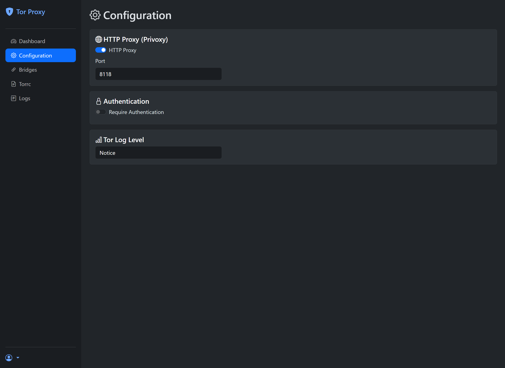
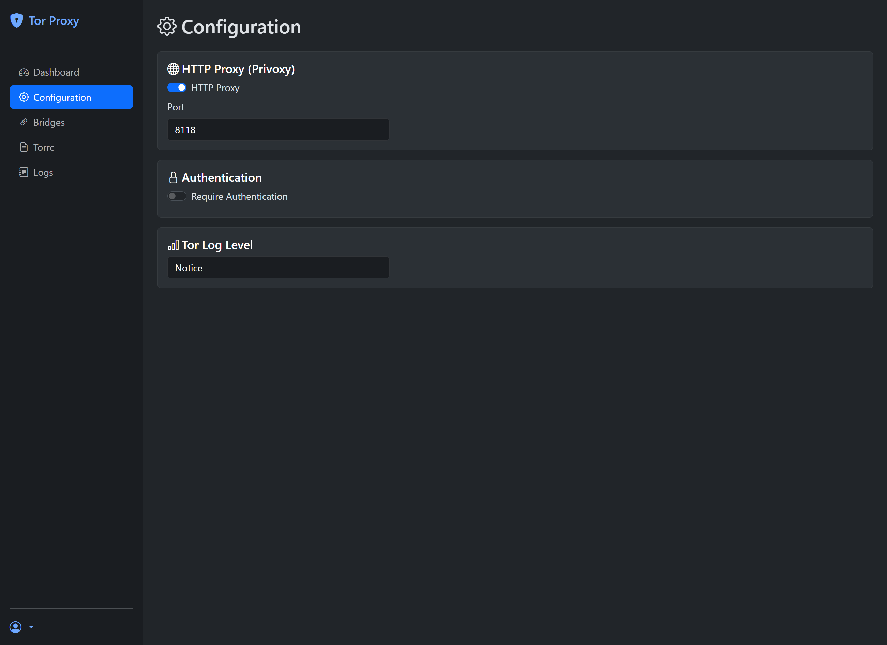
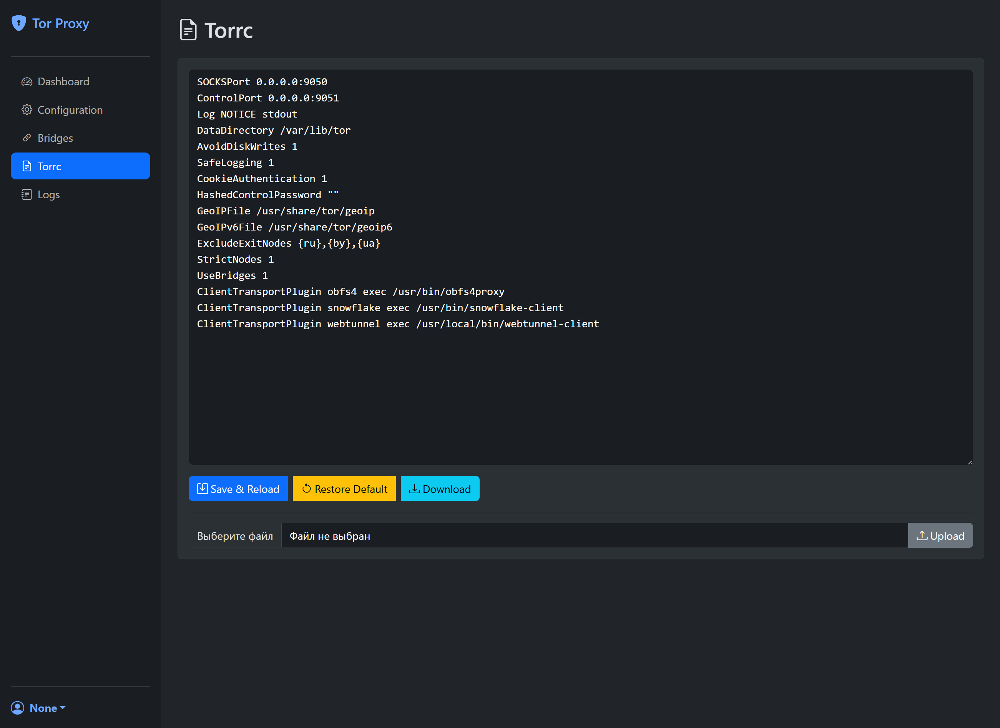
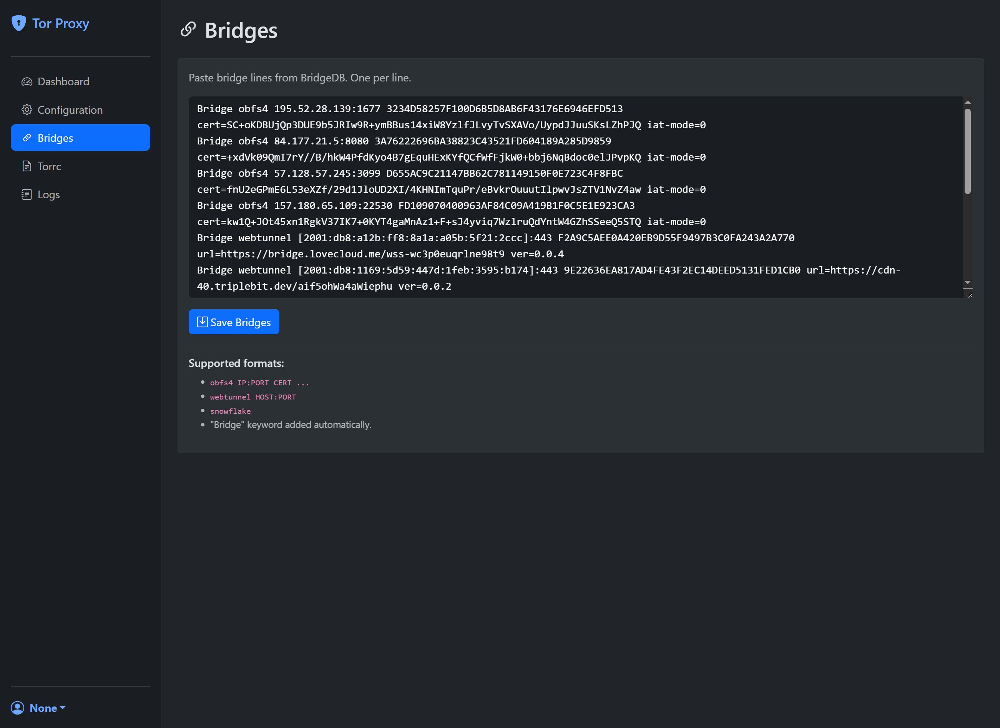
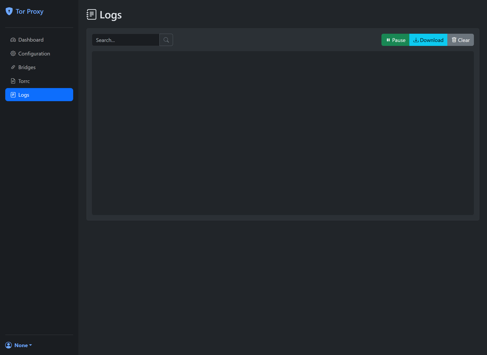

# Tor Proxy Manager

A modern, Docker-based Tor proxy manager with a Web UI for managing Tor circuits, bridges, and configuration. Built with Flask, Bootstrap 5, and vanilla JavaScript.

## Features

### Tor & Proxy Support
- **SOCKS5 Proxy** on port 9050
- **HTTP Proxy** via Privoxy on port 8118
- **Control Port** on 9051 (password protected)
- **DNS Port** on 9053
- **Pluggable Transports**: obfs4, Snowflake, WebTunnel (built from source)

### Web UI (Port 8080)
- **Dashboard** - Real-time Tor status, exit IP, country, circuits, bootstrap progress
- **Configuration** - HTTP Proxy toggle, authentication, log level
- **Torrc Editor** - Syntax-highlighted raw torrc editing with validation
- **Bridges** - Paste bridge lines directly from BridgeDB with auto-normalization
- **Logs** - Live log viewer with search, pause, auto-scroll, and download

### API Endpoints
```
GET  /api/status      - Tor status, exit IP, country, transport, bridges
GET  /api/log         - Recent Tor logs
GET  /api/config      - Current configuration
POST /api/config      - Update configuration
POST /api/restart     - Restart Tor
POST /api/reload      - Reload Tor configuration
POST /api/newnym      - Request NEWNYM circuit
```

### Persistence
All configuration stored in `/config` (bind mount):
- `torrc_base` - Base torrc template
- `torrc` - Generated final torrc
- `bridges.txt` - Bridge lines
- `settings.json` - Web UI settings
- `users.json` - Authentication credentials

## Quick Start

```bash
docker compose up -d --build
```

Access Web UI at `http://localhost:8081` (default: no auth)

## Docker Compose

```yaml
services:
  tor-proxy-manager:
    build: .
    container_name: tor-proxy-manager
    restart: unless-stopped
    ports:
      - "8081:8080"
      - "9050:9050"
      - "8118:8118"
      - "9051:9051"
      - "9053:9053"
    volumes:
      - ./config:/config
      - tor_data:/var/lib/tor
      - tor_logs:/var/log/tor
    environment:
      - TZ=UTC
    cap_add:
      - NET_ADMIN
      - SYS_PTRACE
    security_opt:
      - seccomp:unconfined

volumes:
  tor_data:
  tor_logs:
```

## Configuration

### First Run (Auto-generated)
```
SOCKSPort 0.0.0.0:9050
ControlPort 0.0.0.0:9051
Log NOTICE stdout
DataDirectory /var/lib/tor
AvoidDiskWrites 1
GeoIPFile /usr/share/tor/geoip
GeoIPv6File /usr/share/tor/geoip6
ExcludeExitNodes {ru},{by},{ua}
StrictNodes 1
UseBridges 1
ClientTransportPlugin obfs4 exec /usr/bin/obfs4proxy
ClientTransportPlugin snowflake exec /usr/bin/snowflake-client
ClientTransportPlugin webtunnel exec /usr/local/bin/webtunnel-client
```

### Bridge Format (Auto-normalized)
```
obfs4 1.2.3.4:443 CERT=... iat-mode=0
Bridge obfs4 1.2.3.4:443 CERT=... iat-mode=0
webtunnel [2001:db8::1]:443 url=https://host/path ver=0.0.4
Bridge webtunnel [2001:db8::1]:443 url=https://host/path ver=0.0.4
snowflake
```

### Authentication
Enable in Configuration page. Default: `admin` / `admin123`

## Screenshots

### Dashboard


### Configuration


### Torrc Editor


### Bridges


### Logs


## Architecture

```
tor-proxy-manager/
├── Dockerfile              # Multi-stage build (Debian Bookworm + Go for webtunnel)
├── docker-compose.yml
├── requirements.txt        # Flask, Stem, Gunicorn
├── entrypoint.sh          # Init scripts, config generation
├── supervisord.conf       # Process supervision (tor, privoxy, web)
├── app/
│   ├── __init__.py        # Flask app factory, auth middleware
│   ├── config/            # Config load/save, torrc generation
│   ├── routes/            # Web UI routes (dashboard, config, bridges, torrc, logs)
│   ├── api/               # REST API endpoints
│   ├── services/          # Tor control, Privoxy management
│   ├── templates/         # Jinja2 templates (Bootstrap 5)
│   └── static/            # CSS, JS (vanilla)
└── config/                # Persistent config (bind mount)
```

## Security
- Runs as non-root user (`torproxy`)
- ControlPort not exposed publicly
- CSRF protection on forms
- Password hashing (PBKDF2-SHA256)
- Session-based authentication
- Security headers (CSP, X-Frame-Options, etc.)

## Health Check
Docker HEALTHCHECK verifies Tor bootstrap reaches 100%.

## Multi-Arch
Supports `linux/amd64` and `linux/arm64`.

## License
MIT